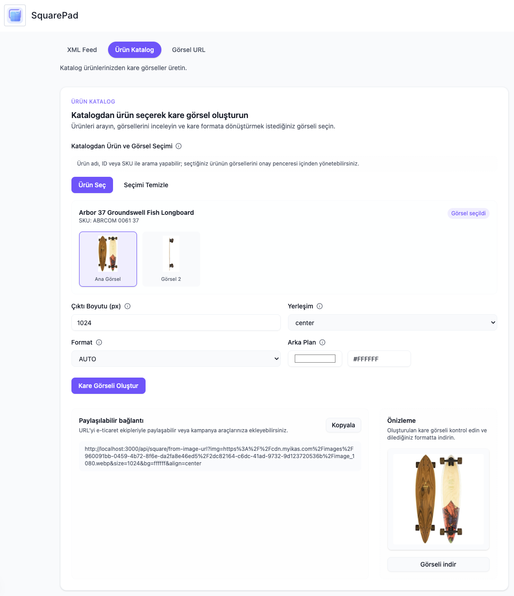

# SquarePad for ikas (Next.js 15)

SquarePad, ikas tüccarlarına yönelik olarak Next.js 15 App Router deneyimi sunar; OAuth, Prisma, GraphQL (codegen), Tailwind + shadcn/ui ve güvenli sunucu rotalarını bir araya getirerek ikas kontrol paneli içinde ürün kataloğu destekli kare görsel araçları sağlar.



## 🚀 Özellikler

- **Next.js 15 + App Router** (React 19 + TypeScript)
- **ikas OAuth** uçtan uca akış (yetkilendir → callback → oturum/JWT)
- **Admin GraphQL istemcisi**: `@ikas/admin-api-client` + codegen
- **Prisma**: OAuth token’larını saklamak için lokal veritabanı (`AuthTokenManager`)
- **Tailwind CSS v4 + shadcn/ui** bileşenleri
- **Iron Session** ile sunucu tarafı oturum yönetimi
- **Frontend ↔ Backend köprüsü**: typed axios yardımcıları
- **SquarePad yönetici deneyimi**: ürün kataloğunu listeleyip kare görsel üretme, görsel URL dönüştürme ve XML feed güncelleme (iframe uyumlu)

## 📁 Proje Yapısı

```
src/
├─ app/
│  ├─ api/
│  │  ├─ ikas/
│  │  │  ├─ get-merchant/route.ts
│  │  │  ├─ products/route.ts
│  │  │  └─ product-images/route.ts
│  │  └─ oauth/
│  │     ├─ authorize/ikas/route.ts
│  │     └─ callback/ikas/route.ts
│  ├─ authorize-store/page.tsx
│  ├─ callback/page.tsx
│  ├─ dashboard/page.tsx
│  ├─ dashboard/squarepad/page.tsx
│  ├─ page.tsx
│  └─ hooks/use-base-home-page.ts
│
├─ components/
│  ├─ home-page/index.tsx
│  ├─ squarepad/
│  │  ├─ image-tab.tsx
│  │  ├─ info-tooltip.tsx
│  │  ├─ inline-hint.tsx
│  │  ├─ product-selection-dialog.tsx
│  │  ├─ product-tab.tsx
│  │  ├─ section-header.tsx
│  │  ├─ squarepad-header.tsx
│  │  └─ tab-switcher.tsx
│  └─ ui/*
│
├─ globals/
│  ├─ config.ts
│  └─ constants.ts
│
├─ helpers/
│  ├─ api-helpers.ts
│  ├─ jwt-helpers.ts
│  └─ token-helpers.ts
│
├─ lib/
│  ├─ api-requests.ts
│  ├─ auth-helpers.ts
│  ├─ ikas-client/
│  │  ├─ graphql-requests.ts
│  │  ├─ codegen.ts
│  │  └─ generated/graphql.ts
│  ├─ prisma.ts
│  ├─ session.ts
│  └─ validation.ts
│
├─ constants/
│  └─ squarepad.ts
├─ types/
│  ├─ squarepad.ts
│  └─ ui.ts
│
└─ models/
   └─ auth-token/
      ├─ index.ts
      └─ manager.ts
```

## 🛠️ Kurulum

1. Bağımlılıkları kurun

```bash
pnpm install
```

2. Çevre değişkenlerini tanımlayın

```bash
cp .env.example .env.local
```

Gerekli env’ler (`src/globals/config.ts`):

- `NEXT_PUBLIC_GRAPH_API_URL`
- `NEXT_PUBLIC_ADMIN_URL`
- `NEXT_PUBLIC_CLIENT_ID`
- `CLIENT_SECRET`
- `NEXT_PUBLIC_DEPLOY_URL`
- `SECRET_COOKIE_PASSWORD`

3. Prisma başlangıcı

```bash
pnpm prisma:init
```

4. GraphQL tiplerini üretin

```bash
pnpm codegen
```

5. Geliştirme sunucusunu başlatın

```bash
pnpm dev
```

`ikas.config.json` dosyası port ve yönlendirme yolunu içerir.

## 📦 Komutlar

- `pnpm dev` — geliştirme sunucusu
- `pnpm build` / `pnpm start` — prod
- `pnpm lint` — ESLint
- `pnpm codegen` — GraphQL codegen
- `pnpm prisma:*` — Prisma yardımcı komutları
- `pnpm apply:ai-rules` — Ruler konfigürasyonlarını uygular

## 🔐 OAuth Akışı

- `/` rotası `use-base-home-page`’i çalıştırır:
  - iframe içindeyse ve `TokenHelpers.getTokenForIframeApp()` ile token bulunursa `/dashboard`’a yönlendirir.
  - `storeName` query paramı varsa `/api/oauth/authorize/ikas?storeName=...` çağrılır.
  - Aksi halde kullanıcı `/authorize-store` sayfasına düşer.
- Yetkilendirme tamamlandığında `callback` rotası HMAC-SHA256 imzasını doğrular, token’ı alır, `AuthTokenManager` ile saklar ve kısa ömürlü JWT oluşturur.
- Müşteri tarafı `/callback` sayfası token’ı depolayıp admin paneline geri yönlendirir.

## 🔑 API Çağrıları

- Tarayıcı kısa ömürlü JWT’yi saklar ve backend rotalarına `Authorization: JWT` başlığıyla erişir.
- Backend’de `getUserFromRequest` JWT’den `merchantId` ve `authorizedAppId` bilgilerini alır, `AuthTokenManager` üzerinden OAuth token’ına ulaşıp `getIkas()` ile GraphQL çağrısı yapar.
- `src/app/api/ikas/products` ve `src/app/api/ikas/product-images` GraphQL sorgularını proksi ederek SquarePad bileşenlerine veri sağlar.

## 🧠 GraphQL Çalışma Akışı

1. İlgili sorgu/mutasyonları `src/lib/ikas-client/graphql-requests.ts` dosyasına ekleyin.
2. MCP yönergelerini izleyerek (list → introspect) operasyonu doğrulayın.
3. `pnpm codegen` çalıştırın.
4. `ikasClient.queries.*` veya `ikasClient.mutations.*` üzerinden kullanın.

## 🗃️ Veritabanı

- Prisma ile SQLite (`prisma/dev.db`) kullanılmakta.
- `AuthTokenManager` OAuth tokenlarını saklar.
- `pnpm prisma:studio` ile kayıtlar incelenebilir.

## 🧩 UI ve Stiller

- Tailwind v4 (`src/app/globals.css`)
- shadcn/ui bileşenleri (`src/components/ui/*`)
- SquarePad arayüzü `src/components/squarepad/*` altında modülerleştirildi.

## 📸 SquarePad Dashboard

`src/app/dashboard/squarepad/page.tsx` dosyası üç sekmeli iç deneyimi sunar:

- **Ürün Katalog**: GraphQL ile ürünleri listeler, varyant SKU’suna göre filtreler, görsel seçer ve kare görsel üretir.
- **Görsel URL**: Harici bir görsel bağlantısını kare formata dönüştürür.
- **XML Feed**: Bir feed içindeki görselleri kare URL’lerle değiştirir ve paylaşılabilir çıktıyı döndürür.

Seçim diyalogları, ipuçları ve tab bileşenleri yeniden kullanılabilir yapıdadır; iframe kullanımına hazırdır.

## 🧰 MCP Yardımcıları

- UI bileşenleri için shadcn MCP.
- GraphQL operasyonları için ikas MCP list + introspect.

## 🔒 Güvenlik Notları

- Token’ları veya gizli bilgileri loglamayın.
- Tarayıcı sadece kısa ömürlü JWT kullanır; gerçek OAuth token’ları sunucuda saklanır.
- `onCheckToken` sunucuda token yenilemeyi otomatik hale getirir.
- OAuth callback HMAC-SHA256 imza doğrulaması yapar.

## 📝 Lisans

MIT

## 🤝 Katkıda Bulunma

- Conventional Commits kullanın (`feat(auth): ...` gibi)
- Tip güvenliğini ve lint kurallarını koruyun.

## 📞 Destek

- ikas Admin GraphQL: `https://api.myikas.com/api/v2/admin/graphql`
- Sorular/öneriler için issue açabilirsiniz.
