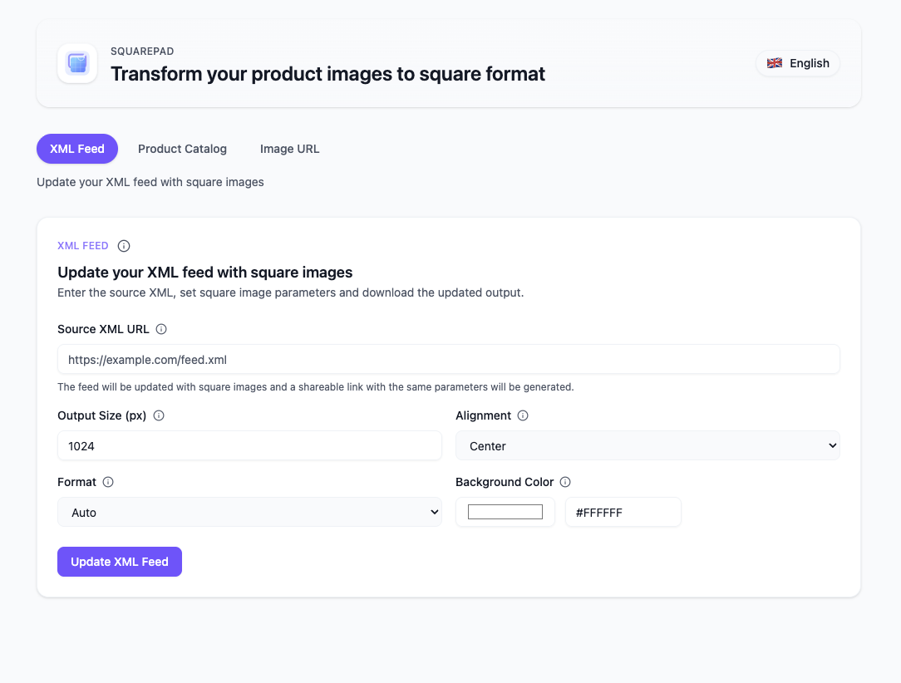

# SquarePad for ikas

SquarePad is a **multi-tenant** Next.js 15 App Router experience for ikas stores that bundles OAuth, Prisma, GraphQL (codegen), Tailwind + shadcn/ui, and secure server routes to deliver product-catalog powered square image tooling inside the ikas dashboard.



> **🏢 Multi-Tenant Architecture**: This app serves multiple ikas stores independently. Each store authorizes via OAuth and gets its own token stored in the database.
> 
> **📚 Quick Links:**
> - 🚀 [Quick Start Guide](./QUICKSTART.md) - Get up and running in 10 minutes
> - 📖 [Multi-Tenant Setup Details](./MULTI-TENANT-SETUP.md) - Complete architecture documentation
> - 🎯 [Summary](./MULTI-TENANT-SUMMARY.md) - TL;DR overview
> - 📊 [Architecture Diagram](./ARCHITECTURE-DIAGRAM.md) - Visual flow diagrams

## 🚀 Features

- **Multi-Tenant Support**: Serves unlimited ikas stores with OAuth-based authorization
- **Next.js 15 + App Router** with React 19 and TypeScript
- **OAuth 2.0 Flow**: Complete end-to-end flow (authorize → callback → session/JWT)
- **Admin GraphQL client**: `@ikas/admin-api-client` with codegen
- **Prisma + PostgreSQL**: Multi-tenant token storage via `AuthTokenManager`
- **Tailwind CSS v4 + shadcn/ui** components
- **Iron Session** server-side session management
- **Frontend ↔ Backend bridge** via typed API helpers
- **SquarePad admin experience** with modular components for product catalog browsing, image transformation, and XML feed updates (iframe friendly)
- **Automatic token refresh**: Tokens auto-refresh before expiration

## 📁 Project Structure

```
src/
├─ app/
│  ├─ api/
│  │  ├─ ikas/
│  │  │  └─ get-merchant/route.ts       # Example secure API route (JWT required)
│  │  └─ oauth/
│  │     ├─ authorize/ikas/route.ts     # Starts OAuth authorization (GET)
│  │     └─ callback/ikas/route.ts      # Handles OAuth callback, saves token
│  ├─ authorize-store/page.tsx           # Manual store authorization page
│  ├─ callback/page.tsx                  # Client handler for OAuth callback redirect
│  ├─ dashboard/page.tsx                 # Authenticated page using JWT + API bridge
│  ├─ page.tsx                           # Entry, decides auth flow
│  └─ hooks/use-base-home-page.ts        # Auth/bootstrap logic
│
├─ components/
│  ├─ home-page/index.tsx                # Simple authenticated UI
│  ├─ squarepad/                         # SquarePad page components
│  │  ├─ image-tab.tsx
│  │  ├─ info-tooltip.tsx
│  │  ├─ inline-hint.tsx
│  │  ├─ product-selection-dialog.tsx
│  │  ├─ product-tab.tsx
│  │  ├─ section-header.tsx
│  │  ├─ squarepad-header.tsx
│  │  └─ tab-switcher.tsx
│  └─ ui/*                               # shadcn/ui components
│
├─ globals/
│  ├─ config.ts                          # Env + OAuth config
│  └─ constants.ts                       # Common constants/types
│
├─ helpers/
│  ├─ api-helpers.ts                     # getIkas(), onCheckToken(), getRedirectUri()
│  ├─ jwt-helpers.ts                     # JWT create/verify
│  └─ token-helpers.ts                   # Token utilities (AppBridge, signature validation)
│
├─ lib/
│  ├─ api-requests.ts                    # Frontend → backend bridge (axios)
│  ├─ auth-helpers.ts                    # getUserFromRequest() (JWT)
│  ├─ ikas-client/
│  │  ├─ graphql-requests.ts             # gql documents (queries/mutations)
│  │  ├─ codegen.ts                      # GraphQL Codegen config
│  │  └─ generated/graphql.ts            # Generated types + client
│  ├─ prisma.ts                          # Prisma client
│  ├─ session.ts                         # iron-session wrappers
│  └─ validation.ts                      # zod helpers
│
└─ models/
   └─ auth-token/                        # Token store via Prisma
      ├─ index.ts                        # AuthToken interface
      └─ manager.ts                      # CRUD with Prisma

├─ constants/
│  └─ squarepad.ts                       # Shared UI constants (align/format lists)
├─ types/
│  ├─ squarepad.ts                       # Shared SquarePad domain types
│  └─ ui.ts                              # Generic UI helper types (copy feedback, etc.)
```

## 🛠️ Setup

1) Install dependencies

```bash
pnpm install
```

2) Create env file and set variables

```bash
cp .env.example .env.local
```

Required envs (see `src/globals/config.ts`):

- `NEXT_PUBLIC_GRAPH_API_URL` — ikas Admin GraphQL URL (e.g. `https://api.myikas.com/api/v2/admin/graphql`)
- `NEXT_PUBLIC_ADMIN_URL` — ikas Admin base with `{storeName}` placeholder (e.g. `https://{storeName}.myikas.com/admin`)
- `NEXT_PUBLIC_CLIENT_ID` — **your app's client id** from [ikas Developer Portal](https://developer.myikas.com) (same for all stores)
- `CLIENT_SECRET` — **your app's client secret** from Developer Portal (same for all stores)
- `NEXT_PUBLIC_DEPLOY_URL` — public base URL of this app (e.g. `https://yourapp.example.com`)
- `SECRET_COOKIE_PASSWORD` — long random string for iron-session
- `DATABASE_URL` — PostgreSQL connection string for multi-tenant token storage

> **⚠️ Important**: `CLIENT_ID` and `CLIENT_SECRET` are **NOT** store-specific. They are your application's credentials from ikas Developer Portal, used for all stores.

3) Initialize Prisma (first run)

```bash
pnpm prisma:init
```

4) Generate GraphQL types (whenever you change `graphql-requests.ts`)

```bash
pnpm codegen
```

5) Start dev server

```bash
pnpm dev
```

Port and redirect path are also defined in `ikas.config.json`:

```json
{
  "portMapping": { "default": 3000 },
  "oauthRedirectPath": "/api/oauth/callback/ikas",
  "runCommand": "pnpm run dev"
}
```

## 📦 Scripts

- `pnpm dev` — start Next.js in dev
- `pnpm build` — build production
- `pnpm start` — start production server
- `pnpm lint` — run ESLint
- `pnpm codegen` — GraphQL Codegen using `src/lib/ikas-client/codegen.ts`
- `pnpm prisma:init` — generate client and push schema to local DB
- `pnpm prisma:migrate` — create/apply migrations
- `pnpm prisma:generate` — regenerate Prisma client
- `pnpm prisma:studio` — open Prisma Studio
- `pnpm apply:ai-rules` — apply Ruler agent configs

## 🔐 OAuth Flow

- User starts at `/` which runs `use-base-home-page`:
  - If embedded (iFrame) and a valid token exists via `TokenHelpers.getTokenForIframeApp()`, redirect to `/dashboard`.
  - Otherwise, if `storeName` is present in query, redirect to `/api/oauth/authorize/ikas?storeName=...`.
  - Else route to `/authorize-store` where user enters store name.

- `GET /api/oauth/authorize/ikas` validates `storeName`, sets `state` in session, and redirects to ikas authorize URL.
- `GET /api/oauth/callback/ikas` validates the `signature` parameter using HMAC-SHA256 (via `TokenHelpers.validateCodeSignature`), optionally validates `state` for CSRF protection, exchanges `code` for tokens, fetches `getMerchant` and `getAuthorizedApp`, upserts token via `AuthTokenManager`, sets session, builds a short-lived JWT via `JwtHelpers.createToken`, and redirects to `/callback?...`.
- `/callback` (client) reads `token`, `redirectUrl`, `authorizedAppId`, stores token in `sessionStorage`, then redirects back to Admin.

### OAuth Callback Security
The OAuth callback endpoint requires a `signature` query parameter to validate the authorization code:
- **Signature Generation**: `HMAC-SHA256(code, clientSecret)` in hex format
- **Validation**: `TokenHelpers.validateCodeSignature(code, signature, clientSecret)`
- **State Parameter**: Optional but recommended for additional CSRF protection

## 🔑 Auth and API Calls

- Browser obtains JWT via AppBridge or OAuth callback and stores it in `sessionStorage`.
- Frontend calls backend routes with `Authorization: JWT <token>`.
- Example backend route: `GET /api/ikas/get-merchant` uses `getUserFromRequest()` to extract `merchantId` and `authorizedAppId`, loads the stored token via `AuthTokenManager`, creates GraphQL client with `getIkas()`, then calls `ikasClient.queries.getMerchant()`.

Frontend bridge (`src/lib/api-requests.ts`):

```ts
ApiRequests.ikas.getMerchant(token) // -> GET /api/ikas/get-merchant
```

## 🧠 GraphQL Workflow (ikas Admin)

- Define documents in `src/lib/ikas-client/graphql-requests.ts` using `gql`:

```ts
export const GET_MERCHANT = gql`
  query getMerchant { getMerchant { id email storeName } }
`;
```

- Run `pnpm codegen` to regenerate `src/lib/ikas-client/generated/graphql.ts`.
- Create client via `getIkas(token)` which auto-refreshes tokens in `onCheckToken`.
- Use: `ikasClient.queries.getMerchant()` or `ikasClient.mutations.someMutation(vars)`.

MCP guidance (required before adding new ops):
- Discover operation with ikas MCP list, then introspect shape.
- Add to `graphql-requests.ts`, then run `pnpm codegen`.

## 🗃️ Database (Prisma)

- **PostgreSQL** database for production (multi-tenant token storage)
- Schema managed by `prisma/schema.prisma`
- `AuthTokenManager` persists OAuth tokens per store (`models/auth-token/*`)
- Each store has a unique `authorizedAppId` as the primary key
- Use Prisma Studio to inspect tokens:

```bash
pnpm prisma:studio
```

### Token Storage Schema

```prisma
model AuthToken {
  id              String   @id
  merchantId      String
  authorizedAppId String?  @unique  // Unique per store
  accessToken     String
  refreshToken    String
  expireDate      DateTime
  // ... other fields
}
```

## 🧩 UI and Styling

- Tailwind v4 with CSS file at `src/app/globals.css`.
- shadcn/ui components under `src/components/ui/*`.
- SquarePad UI is composed from reusable building blocks in `src/components/squarepad/*` so the dashboard page stays small and iframe integrations can reuse the same primitives.

## 📸 SquarePad Dashboard

`src/app/dashboard/squarepad/page.tsx` implements the SquarePad admin tool that merchants access through the ikas dashboard iframe. Başlıca akışlar:

- **Ürün Katalog sekmesi** ürünleri aramak, varyant SKU’larına göre filtrelemek, görsel seçmek ve kare görsel oluşturmak için ikas GraphQL API’sinden gelen verileri kullanır. Görsel seçimi `ProductSelectionDialog` ile yapılır.
- **Görsel URL sekmesi** herhangi bir görsel linkini kare formata dönüştürmenize olanak tanır.
- **XML Feed sekmesi** bir feed içindeki görselleri kare URL’lerle güncelleyerek paylaşılabilir yeni feed çıktısı üretir.
- Tüm sekmeler `SquarePadTabSwitcher`, `SquarePadHeader`, `InlineHint`, `InfoTooltip` gibi küçük bileşenlerle modülerleştirilmiştir. Tür tanımları `src/types/squarepad.ts`, sabitler `src/constants/squarepad.ts` dosyasında tutulur.

Iframe entegrasyonu sırasında token yönetimi `TokenHelpers` üzerinden yapılır; backend `/api/ikas/products` ve `/api/ikas/product-images` uç noktaları GraphQL isteklerini proksi eder.

## 🧰 MCP Helpers

- UI scaffolding: use shadcn MCP to fetch components/demos and place under `src/components/ui/*`.
- ikas GraphQL: use ikas MCP list + introspect before adding operations.

## 🔒 Security

- Never log secrets or tokens. Do not expose access/refresh tokens to the client.
- Use the short-lived JWT for browser → server auth; server uses stored OAuth tokens.
- `onCheckToken` auto-refreshes tokens server-side before expiration.
- OAuth callback uses HMAC-SHA256 signature validation to verify authorization code authenticity before token exchange.
- Each store's tokens are isolated in the database by `authorizedAppId`.
- **Multi-Tenant Security**: Token isolation ensures no cross-store data access.

## 🏢 Multi-Tenant Guide

For detailed information about the multi-tenant architecture and setup process, see:

📖 **[MULTI-TENANT-SETUP.md](./MULTI-TENANT-SETUP.md)**

Key points:
- ✅ One application serves many stores
- ✅ Each store authorizes independently via OAuth
- ✅ Tokens stored per `authorizedAppId` in PostgreSQL
- ✅ No code changes needed to add new stores
- ✅ Store owners install via `/authorize-store` page

## 📝 License

MIT

## 🤝 Contributing

- Use Conventional Commits. Example: `feat(auth): add token refresh on client`
- Ensure type-safety and linter cleanliness.

## 📞 Support

- ikas Admin GraphQL: `https://api.myikas.com/api/v2/admin/graphql`
- File issues or questions in this repo.
